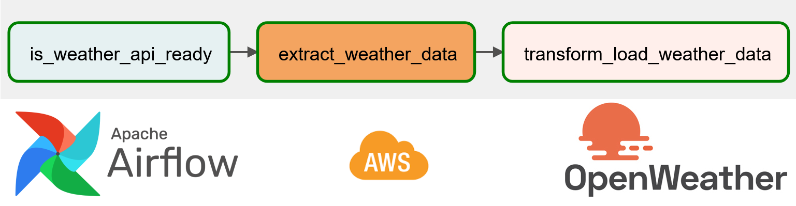

# ETL OpenWeather

In this project, I aimed at constructing and automating an ETL (Extract, Transform, Load) pipeline using Airflow, and some AWS services such as EC2, S3, in order to obtain,
process and store weather data from São Paulo into a datalake.

* Open Weather is an online platform offering weather data and APIs for developers to access and integrate weather 
information into applications and services worldwide. It provides both free and paid plans with various data options. 

* Airflow is an open-source platform used for orchestrating, scheduling, and monitoring complex workflows and data pipelines. 
It allows users to define, manage, and execute tasks as Directed Acyclic Graphs (DAGs).

The code is provided [here](https://github.com/igorcruz91/igor_portfolio/blob/main/ETL%20OpenWeather/openwether_dag.py).

First the code begins by importing the necessary modules and libraries required for the data engineering project. 
These include modules from Airflow, datetime, HttpSensor, SimpleHttpOperator, PythonOperator, and pandas. These modules provide functionalities for 
creating the DAG, scheduling tasks, making HTTP requests, performing data transformations, and handling data in DataFrames.

Then, I defined a function called `kelvin_to_celsius`, since the data retrieved by the API is in Kelvin temperature. 
This function takes a temperature value in Kelvin as input and returns the equivalent temperature in Celsius.

Next, the code defines the `transform_load_data function`. This function is responsible for processing the weather 
data retrieved from the OpenWeatherMap API, transforming it, and loading it into an S3 bucket.

* DAG:

The code defines a dictionary called default_args, which sets default configuration values for the DAG. These include the owner of the DAG, the start date,
email settings for notifications, and retry configurations in case of task failures.

The code creates an instance of the DAG class named `weather_dag`. The DAG's name is set to "weather_dag," and it uses the default_args dictionary defined earlier. 
The DAG is scheduled to run daily (schedule_interval='@daily'), and it is set to not catch up on any missed runs (catchup=False).

The code defines three tasks that constitute the data engineering workflow:

- Checks if the OpenWeatherMap API is ready and accessible.
- Extracts weather data from the OpenWeatherMap API.
- Executes the transform_load_data function defined earlier.

The code defines the dependencies between the tasks using the `>>` notation.
It indicates that the tasks should be executed sequentially in the order: is_weather_api_ready >> extract_weather_data >> transform_load_weather_data.

## Next Steps:

- Collect historical data from Open Weather.
- Build and deploy a Machine Learning model to predict the weather, using AWS services.
  
