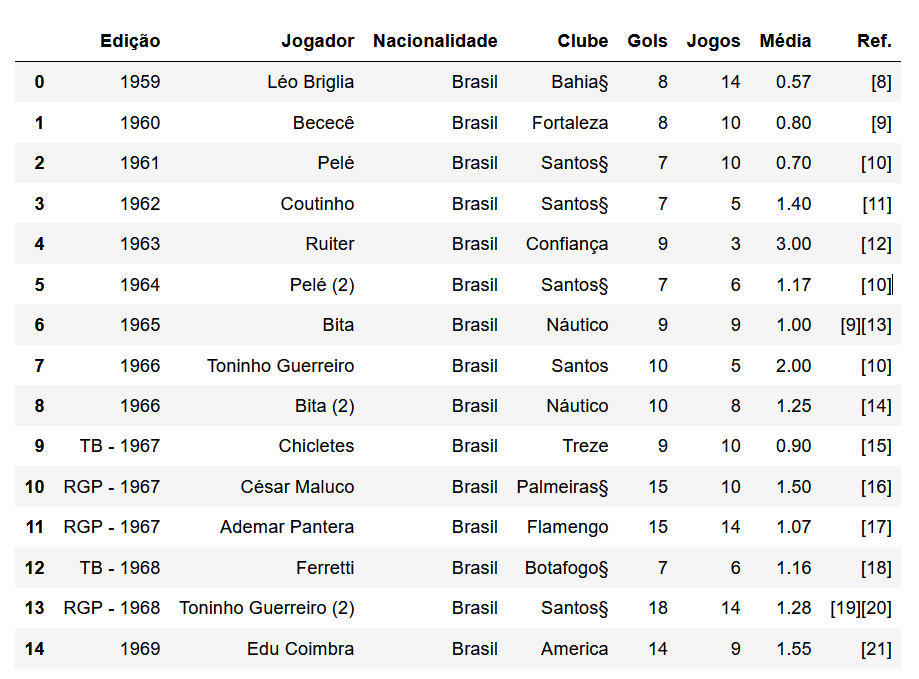
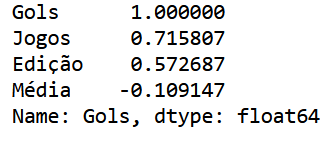
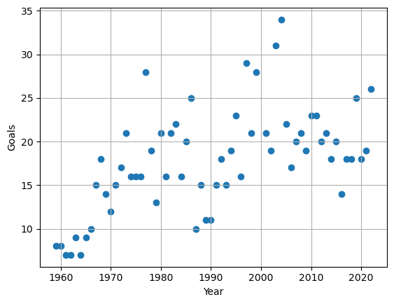
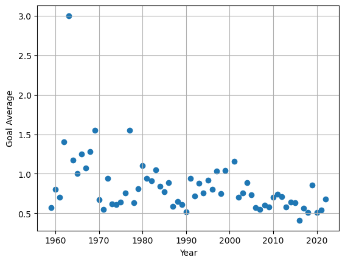
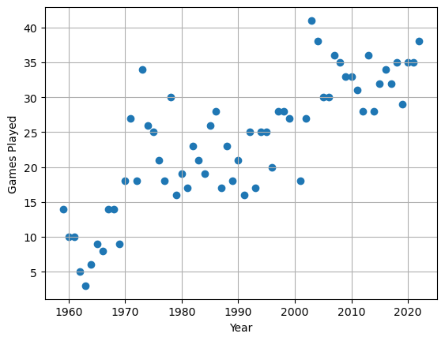
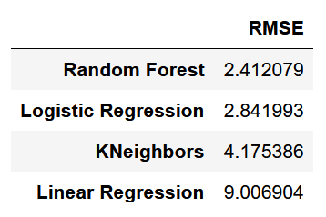

# Project 1: Prediction of the top scorer of the Brazilian football championship

As a football fan I thought about building a machine learning model that predicts how many goals the top scorer has scored in each brazilian championship from 1959 to 2022.

* Data was scrapped from the wikipedia page (https://pt.wikipedia.org/wiki/Lista_de_artilheiros_do_Campeonato_Brasileiro_de_Futebol#Por_edi%C3%A7%C3%A3o) using **requests** and **BeautifulSoup**.
* Mahcine learning models such as **Linear Regression, Logistic Regression, K-Neighbors Regressor** and **Random Forest Regressor** were used to modelling the data.
* **RMSE** was used as the main error metric of the models performances.

### Data Overview
Here is the first 15 rows of our scrapped dataframe

As we may see, there are some data cleaning to work on. First of all there are championship editions with two or more top scorers, and even editions with two top scorers with different number of goals as seen in years 1967 and 1968. This is due to the structure that the championships were organized back in the day. To work around this problem, the top scorer with the highest number of goals was selected for each edition.

### Data Visualization

Since our goal is to train a ML model, our target column is 'Gols'. The feature columns are 'Jogos', 'Edição' and 'Média'. Below is shown the correlation between the feature columns and the target column.

From the correlation table above we see that 'Jogos' and 'Edição' has a positive correlation, whereas 'Média' has a negative correlation. Here are the plots that were made for this project

### ML Models

The machine learning models used were Linear Regression, K-Neighbors Regressor, Random Forest Regressor. RMSE was the main error metric used to evaluate the models performances. The table below contains the RMSE value for each corresponding ML model. From that table, we see that the Random Forest model performed the best with a 2.17 RMSE, that is, the model misses on average the top scorer by 2.17 goals.

### Future Ideas & Analysis

In order to improve the model, here are some ideas for future analysis:

* Obtain new significant features
* Hyperparametrization tuning
* Use other country's championship and compare the models
