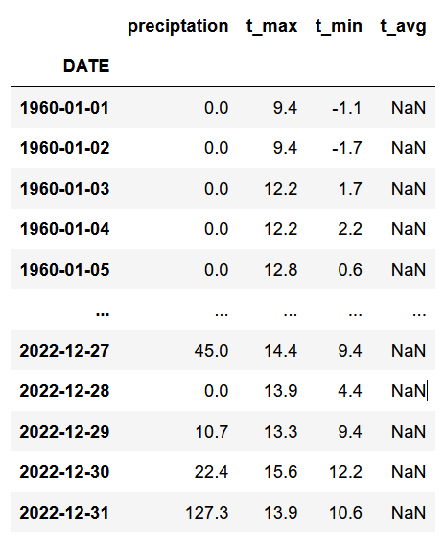
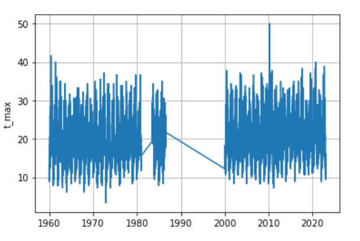
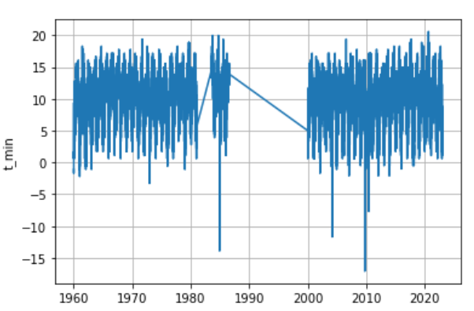
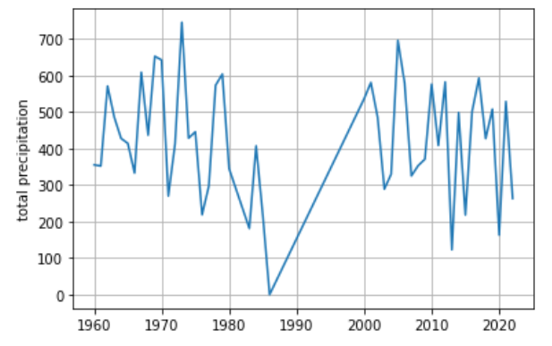
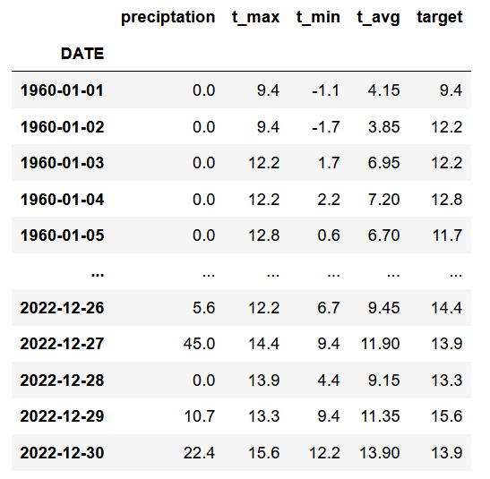
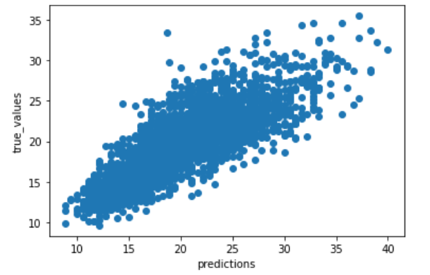
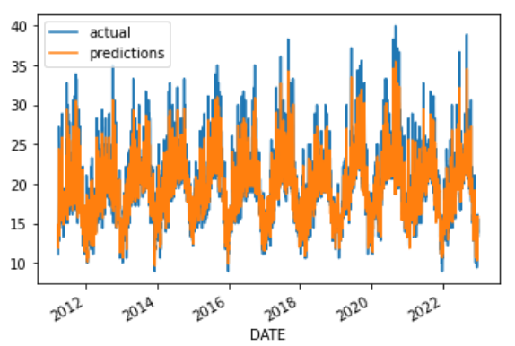
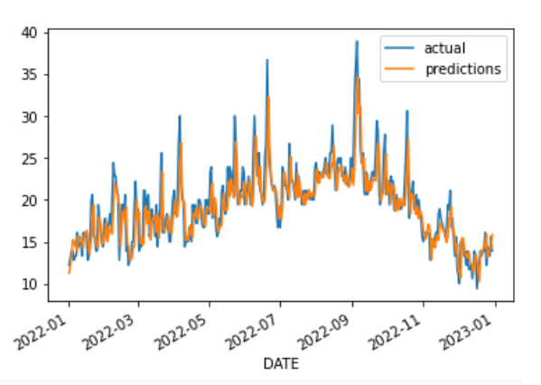
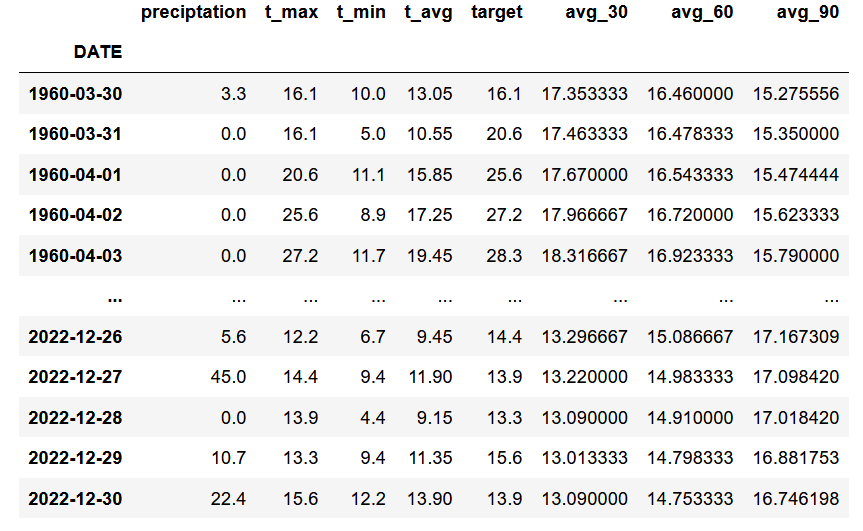

## Project 2: Predicting the Weather using Machine Learning

The main goal of this project is to use real world data and machine learning techniques to predict the weather. First of all I tried to predict the weather from São Paulo, my home town, but unfortunately there were almos 90% of missing data.
Utilizing NOAA's data as our main data source, I choosed the city of Oakland - CA, to make the predictions, since there were just few missing data. The data goes from 1960-2022. You can acess the notebook of this project .

* Data was downloaded from NOAA's .
* Machine Learning models such as **Linear Regression** and **Random Forests** were used.
* **RMSE** was used as the main error metric of the models performances.

### Data Overview

Below is a list of the main columns initially used from the data

`precipitation` - precipitation (mm)

`t_max` - maximum temperature (°C)

`t_min` - minimum temperature (°C)

`t_avg` - average temperature (°C)

Here is the data preview

The initial dataframe contained a lot of columns that were not usefull, or that contained only one value, which does not help with the modelling. For those purposes, the only relevant columns used were listed above, and the other columns were removed.
You may check the data cleaning process acessing the notebook.

### Data Visualization

One of the first thing we may do to help understand the data is visualize it.

From the last graph, we see that there is some data missing from mid 80's to the beginning of the 00's. The file containig the data did not mention the reason why there's this gap. Since my main goal is to predict tomorrow's temperature from historical data, I created a column named `target` that contains the actual temperature of the next day.

### Machine Learning Models

The data was splitted into train and test sets, using 75% of the data as training set and not shuffling the rows. The first model used was **Linear Regression**. Using this model, I obtained a **RMSE** value of 2.62 °C, that is, I am missing on average the actual temperature by 2.62 °C. Below we see the comparison between the true values and the predicted ones.

Here is the plot comparing the model's prediction and the actual temperatures for the entire test set and the comparison for the year 2022.

I tried to decrease the RMSE value by adding new columns to my dataset. I added the 30, 60 and 90 days rolling mean temperatures.

With the new features dataset, the **RMSE** obtained was 2.55 °C.

Since the data may have some non-linear relations, I used the **Random Forest** algorithm, with its default parameters, to make the predictions. With the **Random Forest**, I obtained a **RMSE** value of 2.68 °C. That is, the Linear Regression algorithm performed better thant the Random Forest algorithm.

### Future Ideas & Analysis

* Use new data sources and do feature engeneering.
* Use other algorithms to test if it fits better the data and reduce RMSE.
* Predict the temperature for next days, months, year.
