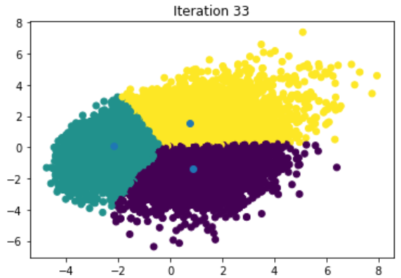
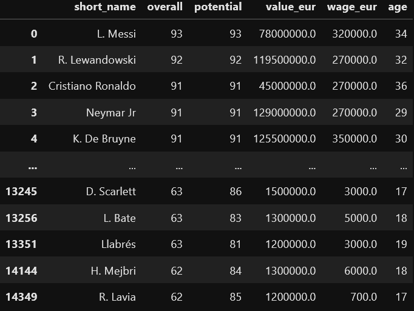
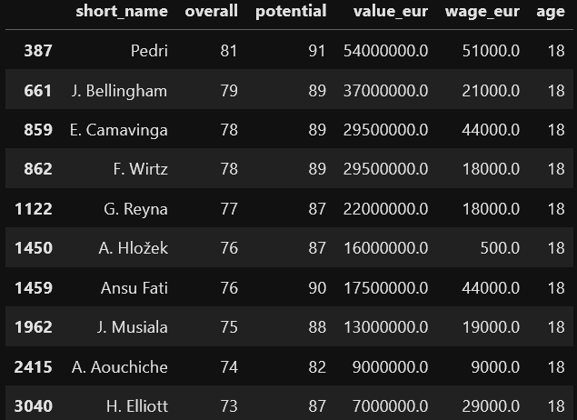
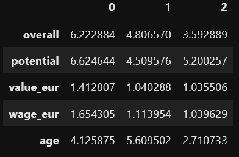

## Project 3: Clustering FIFA 22 players

This project was designed to implement **k-means** clustering algorithm, an unsupervised machine learning technique, with all FIFA 22 players in order to find patterns in our data and analyze some results. The notebook for this project is available .

* Dataset can be downloaded .
* K-Means clustering algorithm was built from scratch, and later compared with sci-kitlearn.

### Data Overview

The dataset comes with several columns, including club logo from each player, nation flag, etc. For this task I worked only with the columns or features listed below.

`overall` - players rating 

`potential` - potential player rating

`value_eur` - how much the player is valued in euros

`wage_eur` - how much is the player salary in euros

`age` - player age

### Data Visualization

Here are some plots of our dataset. First of all, I plotted the age distribution between all players contained in the dataset. Secondly, I plotted the players overall distribution.

From the plot above we see a positive skewness, that is, the mass of the distribution is concentrated on the left.

For the overall distribution, we see a gaussian curve.

### Scaling the data

From the initial data, we see that our columns have lots of different orders of magnitude and I would like to treat each column
equally. For this purpose, I scalled the columns to have values between 1-10, with 10 being the maximun value for each column and 1 beign the minimum value for each column.

### K-Means algorithm implementation

Now that the data is scaled, I implemented the k-means algorithm. First I generated a random centroid. The centroid is the data point that is in the center of the cluster. For this project I choosed three centroids. Here is a table containing the centroids features values.

Now, with respect to each centroid the euclidean distance between every data point was calculated. For each data point, it was assigned cluster labels (0, 1 or 2) according to the minimum distance to the centroids. The centroids are updated based on who is on the cluster, by calculating the geometric mean of each feature.

In order to plot the clusters, I used the PCA (Principal Component Analysis) to help visualize them, since our features dimension is 5. I used 100 iterations for the centroid update. The algorithm stops if the number of iterations reach the choosed value (100) or if the centroids converge and stop updating. Here is the clustering plot of the data.

From the plot above, we see that it took 33 iterations to converge.

### Analyzing Clusters

Now that every player is assigned to a cluster, we may analyze what type of players each cluster have. For example, taking the cluster label 2 we have this dataset

Looking at the players contained in this dataset, we see that this cluster have high overall players, players with high potential, and relatively young players. One important thing for clubs is to sign young and promissing players. For this purpose, it is easy to list those type of players having the clusters. Here is a dataset containing the top 10 players with 18 years old.

Checking the players from the other two clusters, we conclude that the first cluster have players with high age that reached its potential, and the second cluster have players younger than the first cluster, not highly rated that reached its overall rating.

### Comparing with sci-kitlearn

Implementing the K-Means algorithm using sci-kitlearn, I obtained the centroids shown below.

With this implementation is possible to see that the the clusters are similar with the ones obtained by my K-Means algorithm. The advantage of using sci-kitlearn's implementation is that uses fewer code to perform the clustering.

### Future Ideas & Analysis

* Implement other clustering techniques besides K-Means
* Use other distances other than euclidean for the clustering algorithm
* Group players by position and perform clustering for each position
