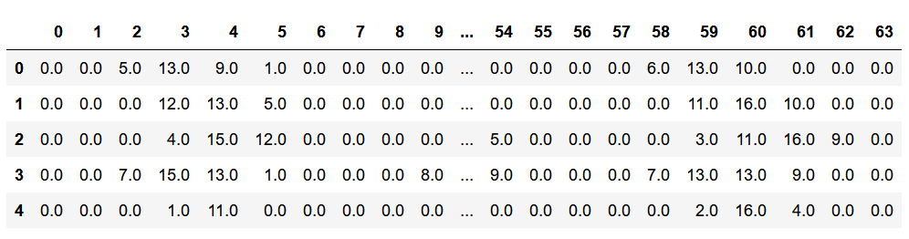
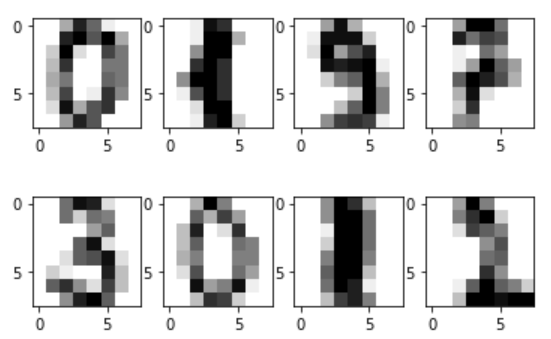
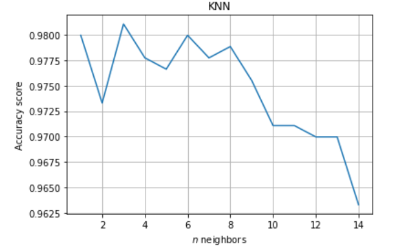
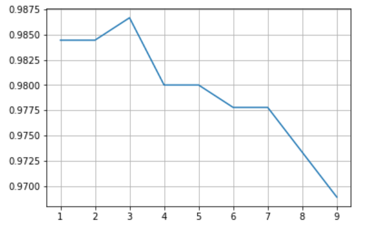
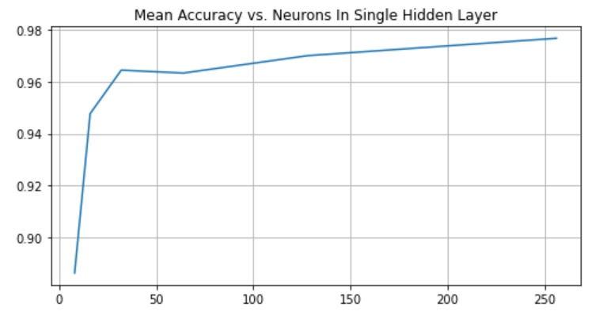
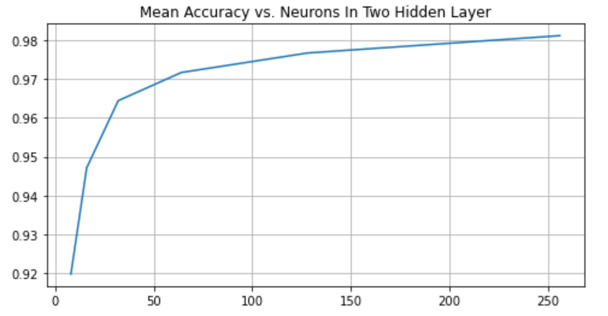
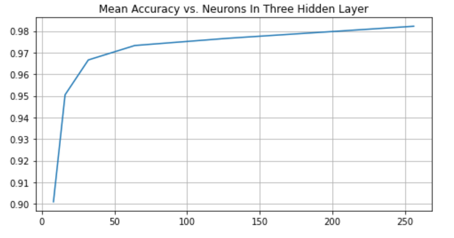

# Project 4: Classify handwritten digits with Neural Networks

This projects goal is to implement **Neural Networks** and the **K-Nearest Neighbors** algorithm to classify handwritten digits and evaluate the models accuracy. For this project, I used the hand-written digits dataset from UCI that can be obtained .

* You may acess the notebook in this [link](https://github.com/igorcruz91/igor_portfolio/blob/main/Project%204%20Neural%20Networks/Neural%20Networks%20Classifier.ipynb).

### Data Overview

The dataset contains lots of images such that each image is represented as a row of pixel values, as is shown below.

In order to visualize the images it is necessary to reshape them to its original form, which is a 8x8 pixels images. Here are the images corresponding to some of the datapoints. The first row corresponds to rows 0, 100, 200, and 300. The second row corresponds to rows 1000, 1100, 1200, and 1300.

The dataset was splitted into train and test sets, using 50% of the data for the training set and the remaining 50% for the test set.

### K-Nearst Neighbors Classifier

In order to classify the images, I first used the **K-Nearst Neighbors** algorithm. Using the parameter `n_neighbors = 5` I built a function that uses KNeighborsClassifer for training k-nearest neighbors models. The accuracy obtained from that model was 97.66%.

The choice of the parameter `n_neighbors = 5` is a bit random, and because of that I tested the model's accuracy with different values. Below is a graph of the model's performance with different values of `n`.

From the plot above, we may see that the models best performs when `n=3`, which results an accuracy greater than 98%.
I implemented a **K-Fold** algorithm as well, to cross validade the accuracy of the KNN models, using the number of folds equal to 4. The mean accuracies with respect to the number of neighbors is plotted below.

### Neural Networks

Neural Networks may be used to classification problems. For this project I used the **MLPClassifier (Multi-layer Perceptron classifier)**. First of all, I used a neural network with a single hidden layer and again used the K-Fold to cross validate the accuracy of the model's performance.

* Single Hidden Layer
 
For the single hidden layer network, I used `8, 16, 32, 64, 128` and `256` neurons respectivelly and evaluated the models performance. Here is a plot of the model's performance.

From the graph, we see that when we increase the number of neurons in one single layer, we improve the mean accuracy. Besides that, the model strugles to reach a mean accuracy of 98%. Comparing the results to the KNN model, we see that the KNN model performed better, achieving an accuracy of 98%, therefore using only one single layer of the NN model may not a good choice for this classification problem.

* Two Hidden Layers

For the two hidden layers, I used a symmetric distribution of neurons for each layer, that is, the number of neurons in the first layer matches the number of neurons in the second layer. I used (8,8), (16,16), (32,32), (64,64), (128,128) and (256,256) neurons for each layer. Here is the plot of the models performance using the indicated neurons.

With 2 hidden layers, our model performed better in comparison with the 1 hidden layer NN model, surpassing 98% of accuracy with neurons between 200 and 250 in each layer.

* Three Hidden Layers

With three hidden layers, I set the number of neurons in each layer to be equal. I used (8,8,8), (16,16,16), (32,32,32), (64,64,64), (128,128,128), (256,256,256) neurons for each layer. Here is the plot of the models performance using the indicated neurons.

With 3 hidden layers, our model performed better in comparison with the 1 and 2 hidden layers NN models, surpassing 98% of accuracy with aproximately 200 neurons in each layer.
