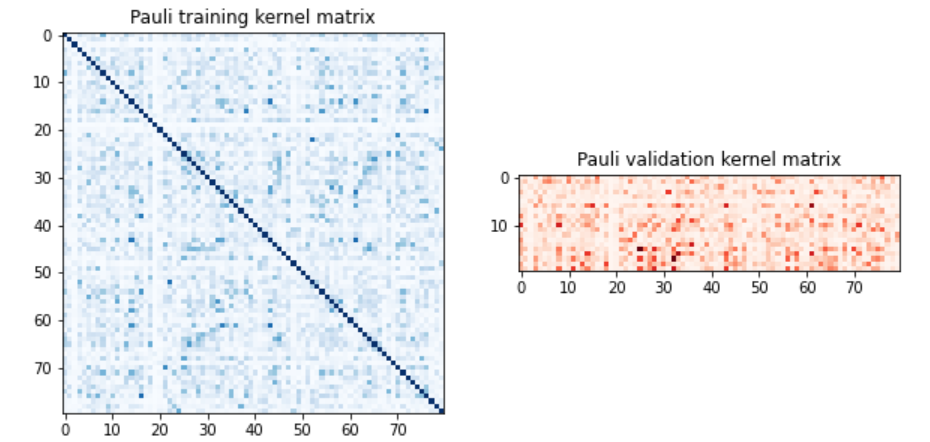
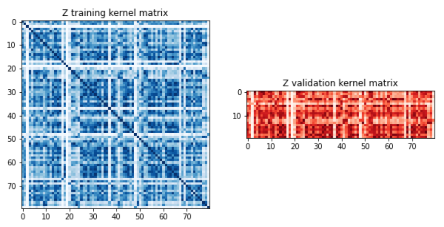
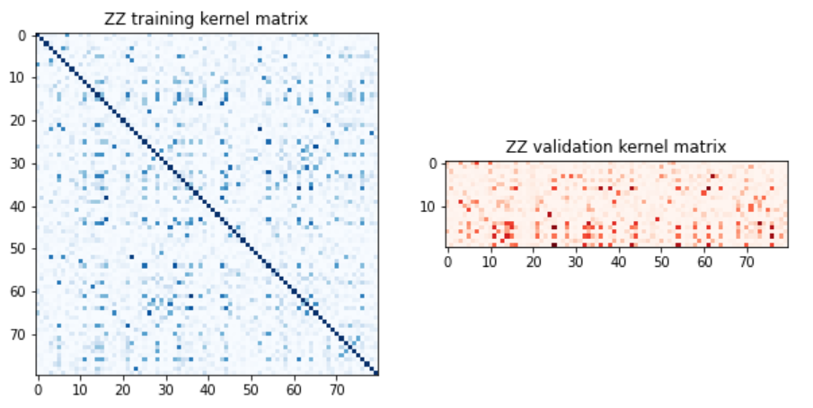
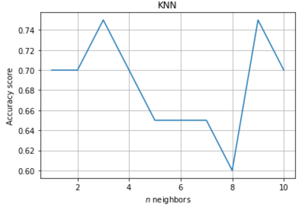

# Project 5: Quantum Support Vector Machine (QSVM) for Classification Problem

This projects goal is to implement a QSVM model for binary classification and predict labels accurately, and later compare its performance with the KNN algorithm. QSVM is a quantum version of the Support Vector Machine (SVM), a classical machine learning algorithm.

The main advantages of using QSVMs over classical SVMs are: 

* Improve efficiency, providing exponential speedup over classical SVMs when trained on large datasets.

* Increase accuracy, providing higher accuracy than classical SVMs when trained on complex datasets, especially when dealing with high-dimensional or nonlinear data. 

* Ability to handle larger feature spaces, quantum computers can perform certain calculations on large vectors or matrices more efficiently than classical computers.

* Flexibility in kernel design, they can utilize quantum kernels that are not possible, or very difficult, to implement on classical hardware.

For this project I used the MNIST digits dataset in order to differentiate between the numbers `4` and `9`. You may acess the dataset here. In this dataset there are a total of 100 data which 80 are labeled training data, and the remaining twenty are unlabeled test data.

In order to utilize the dataset for quantum classification, it is necessary to normalize the range between -1 and 1, as well as reduce the dimensionality to the desired number of qubits (in this case, 5). I used the `StandardScaler()`, `MinMaxScaler((-1, 1))` and the `Principal Component Analysis (PCA)` to do this task.

The data available is classical, therefore in order to use a quantum computer we must transform the classical data in quantum states. The Quantum Feature Map is responsible for this task. There are 3 main Feature Maps that was used in this project:

* Pauli Feature Map
* Z Feature Map
* ZZ Feature Map

Besides the feature maps, there is the Quantum Kernels. In classical machine learning, kernel functions are used to transform the input data into a higher-dimensional feature space, where linear classification algorithms, such as SVMs, can be used to separate the data into different classes.

Using the `PauliFeatureMap`, the test score obtained was `70.0%`. Now lets see how the other feature maps performed.

Using the `ZFeatureMap` the score obtained was `80.0%`. Using the `ZZFeatureMap` the score obtained was `40.0%`.

### Hyperparameter Tuning

In order to increase the scores, I tried to change the parameters `reps` and `entanglement` from the feature maps used. For the `PauliFeatureMap` and `ZFeatureMap` there were no increase score changing the parameters. Only `ZZFeatureMap` increased the score to `65%` when `reps=10` and `entanglement=full`.

### KNN

I used the KNN algorithm to compare its performance with the performance of the quantum classifiers. Using `n_neighbors=5`, I obtained a score of `65%`, which is equal to the ZZFeatureMap with the tuned hyperparameters, but less than the scores of ZFeatureMap and the PauliFeatureMap. For that reason I tried to change the parameter `n_neighbors` from 1 to 10 and compute its score. Here is the result:

From the graph above, we see that the KNN algorithm obtained an acuraccy above `74%` when `n_neighbors=3` or `n_neighbors=9`. The conclusion is that classical algorithm did not performed better than the quantum SVM.

### Next Steps

* Try other classification algorithms, like Neural Networks, and compare them to the quantum version.
* Use bigger datasets for classification problems.
* QSVM for 3-class classification of Fashion-MNIST.
