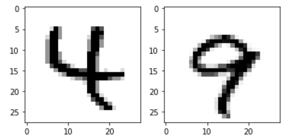

# Project 5: Quantum Support Vector Machine (QSVM) for Classification Problem

This projects goal is to implement a QSVM model for binary classification and predict labels accurately, and later compare its performance with the KNN algorithm. QSVM is a quantum version of the Support Vector Machine (SVM), a classical machine learning algorithm.

The main advantages of using QSVMs over classical SVMs are: 

* Improve efficiency, providing exponential speedup over classical SVMs when trained on large datasets.

* Increase accuracy, providing higher accuracy than classical SVMs when trained on complex datasets, especially when dealing with high-dimensional or nonlinear data. 

* Ability to handle larger feature spaces, quantum computers can perform certain calculations on large vectors or matrices more efficiently than classical computers.

* Flexibility in kernel design, they can utilize quantum kernels that are not possible, or very difficult, to implement on classical hardware.

For this project I used the MNIST digits dataset in order to differentiate between the numbers `4` and `9`. You may acess the dataset here. In this dataset there are a total of 100 data which 80 are labeled training data, and the remaining twenty are unlabeled test data.

{:height="200" width="200"}

