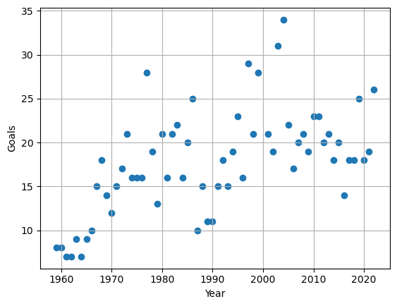

# Data Projects Portfolio

# [Project 1: Prediction of the top scorer of the Brazilian football championship](https://igorcruz91.github.io/igor_portfolio/)

This project aims to predict how many goals the top scorer has scored in each brazilian championship from 1959 to 2022. 

* Data was scrapped from the wikipedia page (https://pt.wikipedia.org/wiki/Lista_de_artilheiros_do_Campeonato_Brasileiro_de_Futebol#Por_edi%C3%A7%C3%A3o) using **requests** and **BeautifulSoup**.
* Mahcine learning models as **Linear Regression, Logistic Regression, K-Neighbors Regressor** and **Random Forest Regressor** were used to modelling the data.
* **RMSE** was used as the main error metric of the models performances.

## Overview of each top scorer and its corresponding year 

## Average goals per year from each top scorer ![] 
